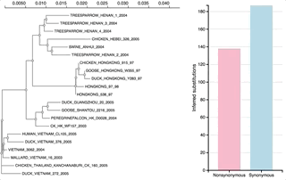
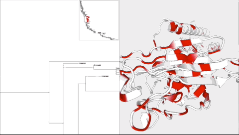

# phylotree.js

A JavaScript library for developing applications and interactive visualizations involving [phylogenetic trees](https://en.wikipedia.org/wiki/Phylogenetic_tree), written as an extension of the [D3](http://d3js.org) [hierarchy layout](https://github.com/d3/d3-3.x-api-reference/blob/master/Hierarchy-Layout.md). It generates high quality SVG vector graphics, allows a great degree of customizability (CSS or JavaScript callbacks), and comes with a lot of *built-in* convenience features. 

## Documentation

Documentation for phylotree.js can be [found here](http://phylotree.hyphy.org/documentation).

## Examples

With `phylotree.js`, it is possible to interface phylogenetic trees with a variety of other software to produce custom, interactive visualizations of phylogenetic data. A simple example entails a [small tree that interacts with a D3.js bar chart](http://phylotree.hyphy.org/examples/phylo-bar/):



while a complex example involves a [large tree that interacts with a structural viewer](http://phylotree.hyphy.org/examples/large-ancestral-structural-viewer/):



### Gallery

A [gallery of examples](http://phylotree.hyphy.org/documentation/examples.html) is a good place to learn different ways that phylotree.js can be used to display and annotate trees. 

### Standalone web application

A [full-featured web application](http://veg.github.io/phylotree.js/index.html) based on phylotree.js, implemented in [index.html](index.html).

### Molecular evolution platforms

phylotree.js is also used by the 2017 revision of the [datamonkey.org server](http://datamonkey.org) for molecular sequence analysis. 

## Features

* Capable of handling multiple selection categories for comparative analysis.
* Several mechanisms for selecting branches, including by clade, path to root, individual branches, internal branches, leaves, and branches that are nearby after layout.
* Runs entirely in the browser, including Newick/PhyloXML/NexML parsing. 
* Can handle trees with thousands of tips.
* Supports linear, radial, scaled branch, tip-aligned, and scaled tip size views.
* The viewer can be constrained to fit in a given SVG box, or scale based on the size of the tree.
* Numerous interactive features, including
   * Scaling 
   * Animated rerooting
   * Ladderization
   * Clade collapse and hiding to explore large trees
   * Node, clade, and subtree selection
   * Tools to automatically select subsets of tree branches based on conditions.
* Style customizations based on CSS and JavaScript callbacks
   * Color branches and tips, including gradient shading for continuous traits. 
   * Customize the way tip names are displayed
   * Transform branch lengths based on branch attributes (e.g. a non-linear scale).
   * Redefine the way a tree is displayed by writing custom CSS
* Available on [npm](https://www.npmjs.com/package/phylotree) to facilitate modern JavaScript development.

## Dependencies 

See [package.json](package.json) for dependencies. 

## Development

### Documentation

Documentation was created using [sphinx-js](https://github.com/erikrose/sphinx-js). Install with

```
pip install -r requirements.txt
```

and build with

```
npm run docs
```

### Tests

Run tests using `mocha`.